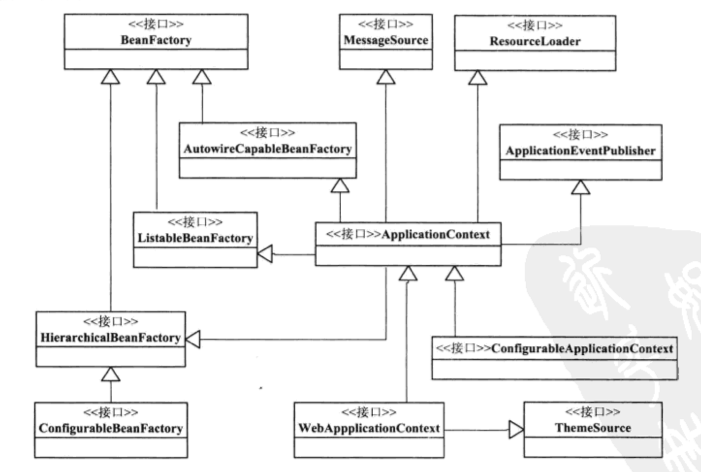
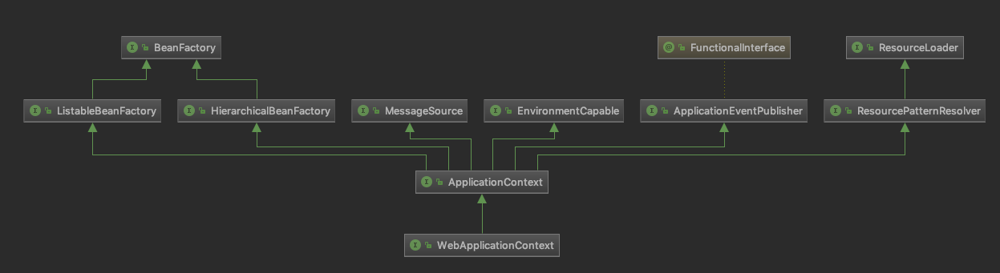
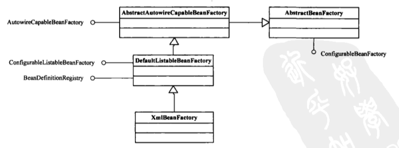
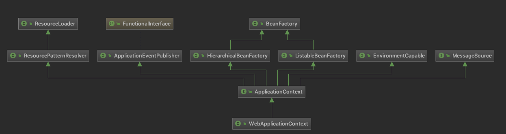

### 概括

Spring IoC容器设计中，主要有两个系列，

* 实现了BeanFactory接口的简单容器系列，
  * 这系列容器只实现了容器最基本功能；
* ApplicationContext应用上下文
  * 它作为容器的高级形态而存在，在BeanFactory基础上增加了许多面向框架的特性，同时对应用环境做了许多适配。

就想商品需要有产品规格说明一样，同样，作为IoC容器，也需要为它的具体实现指定基本的功能规范。这个功能规范的设计表现为接口类BeanFactory，它体现了Spring为提供给用户使用的
IoC容器所设定的最基本的功能规范。

以百货商店出售水桶为例，如果把IoC容器看成一个水桶，那么这个BeanFactory就定义了可以作为水桶的基本功能，比如至少能装水，有个提手等。除了满足基本的功能，为了不同场合的需要，水桶的生产厂家还在这个基础上为用户设计了其他各式各样的水桶产品，以满足不同的用户需求。这些水桶会提供更丰富的功能，有简约型的，有豪华型的，等等。但是，不管是什么水桶，他都需要有一项最基本的功能：能够装水。那对Spring的具体IoC容器实现来说，它需要满足的基本特性是什么呢？它需要满足BeanFactory这个基本的接口定义，BeanFactory作为一个最基本的接口类出现在Spring的IoC容器体系中。

在这些Spring提供的基本Ioc容器的接口定义和实现的基础上，Spring通过定义BeanDefinition来管理基于Spring的应用中的各种对象以及它们之间的相互依赖关系。BeanDefinition抽象了我们对Bean的定义，是让容器起作用的主要数据类型。在计算机世界里，所有的功能都是建立在通过数据对现实进行抽象的基础上的。**IoC容器是用来管理对象依赖关系的，对IoC容器来说，BeanDefinition就是对依赖反转模式中管理的对象依赖关系的数据抽象，也是容器实现依赖反转功能的核心数据结构，依赖反转功能都是围绕这个BeanDefinition的处理来完成的。**

***

> 1、BeanFactory和ApplicationContext之间的区别与联系？


***

### 1 Spring IoC容器设计



* 从接口BeanFactory到HierarchicalBeanFactory，再到ConfigurableBeanFactory，是一条主要的BeanFactory设计路径。在这条接口设计路径中，BeanFactory接口定义了基本的IoC容器规范。在这个接口定义中，包括了**getBean()**这样的IoC容器的基本方法(通过这个方法可以从容器中取得Bean)。而HierarchicalBeanFactory接口在继承了BeanFactory的基本接口之后，增加了**getParentBeanFactory()**的接口功能，使BeanFactory具备了双亲IoC容器的管理功能。在接下来的ConfigurableBeanFactory接口中，主要定义了一些对BeanFactory的配置功能，比如通过**setParentBeanFactory()**设置双亲IoC容器，通过**addBeanPostProcessor()**配置Bean后置处理器，等等。通过这些接口设计的叠加，定义了BeanFactory就是简单IoC容器的基本功能。
* 第二条接口设计主线是，以ApplicationContext应用上下文接口为核心的接口设计，这里设计的主要接口设计有，从BeanFactory到ListableBeanFactory，再到ApplicationContext，再到我们常用的WebApplicationContext或者ConfigurableApplicationContext的实现。在这个接口体系中，ListableBeanFactory和HierarchicalBeanFactory两个接口，连接BeanFactory接口定义和ApplicationContext应用上下文的接口定义。在ListableBeanFactory接口中，细化了许多BeanFactory的接口功能，比如定义了**getBeanDefinitiaonNames()**接口方法；对于ApplicationContext接口，它通过继承MessageSource、ResourceLoader、ApplicationEventPublisher接口，在BeanFactory简单IoC容器的基础上添加了许多对高级容器的特性支持。
* 这里设计的是主要接口关系，而具体的IoC容器都是在这个几口体系下实现的，比如**DefaultListableBeanFactory**，这个基本IoC容器的实现就是现实了Configurable-BeanFactory，从而成为一个简单的IoC容器的实现。像其他IoC容器，比如XmlBeanFactory，都是在**DefaultListableBeanFactory**的基础上做扩展，同样地，ApplicationContext的实现也是如此。
* 这个接口系统是以BeanFactory和ApplicationContext为核心的。而BeanFactory又是IoC容器的最基本接口，在Applicationcontext的设计中，一方面，可以看到它继承了BeanFactory接口体系中的ListableBeanFactory、AutowireCapableBeanFactory、HierarchicalBeanFactory等BeanFactory的接口，具备了BeanFactory IoC容器的基本功能；另一方面，通过继承MessageSource、ResourceLoader、ApplicationEventPublisher这些接口，BeanFactory为ApplicationContext赋予了更高级的IoC容器特性。对于ApplicationContext而言，为了在Web环境中使用它，还设计了WebApplicationContext接口，而这个接口通过继承ThemeSource接口来扩充功能。





### 2.BeanFactory的应用场景

BeanFactory提供最基本的IoC容器功能。

BeanFactory接口定义了IoC容器最基本的形式，并且提供了IoC容器所应该遵守的最基本服务契约，同时，这也是我们使用IoC容器所应该遵守的最底层和最基本的编程规范，这些接口定义勾画了IoC的基本轮廓。而DefaultListableBeanFactory、XmlBeanFactory、ApplicationContext等都可以看成是容器附加了某种功能的具体实现，是容器体系中的具体容器产品。

用户使用容器时，可以使用转义符号“&”来得到FactoryBean本身，用来区分通过容器来获取FactoryBean产生的对象和获取FactoryBean本身。举例来说，如果myJndiObject是一个FactoryBean，那么使用**&myJndiObject**得到的是FactoryBean，而不是myJndiObject这个FactoryBean产生出来的对象。

***

> FactoryBean和BeanFactory的区别？

* FactoryBean 侧重Bean
  * Bean
  * 所有的Bean都是有BeanFactory(Ioc容器)来进行管理的。
  * FactoryBean不是一个简单的Bean，是一个能产生或者修饰对象生成的工厂Bean，它的实现与设计模式中的工厂模式和修饰器模式类似。
* BeanFactory 侧重Factory
  * Ioc容器/对象工厂
  * BeanFactory接口设计了getBean方法，来从Ioc容器中获取Bean。

***

BeanFactory接口设计了getBean方法，来从Ioc容器中获取Bean。Bean的取得是通过指定名字来索引的。如果需要在获取Bean时对Bean的类型进行检查，BeanFactory接口定义了带有参数的getBean方法，这个方法的使用与不带参数的getBean方法类似，不同的是增加了对Bean检索的类型要求。

可以通过BeanFactory方法中的getBean(String name)方法，通过name获取Bean；如果需要获取的Bean是prototype类型，用户还可以为这个prototype类型的Bean生成指定构造函数的对应参数。这使得在一定程度上可以控制生成prototype类型的Bean。有了BeanFactory定义，还可以执行一下操作：

* 通过接口方法containsBean让用户能够判断容器是否含有指定名字的Bean
* 通过接口方法isSingleton来查询指定名字的Bean是否是Singleton类型的Bean。对于Singleton属性，用户可以在BeanDefinition中指定。
* 通过接口方法isPrototype来查询指定名字的Bean是否是prototype类型的。对于Prototype属性，用户可以在BeanDefinition中指定。
* 通过接口方法isTypeMatch来查询指定名字的Bean的Class类型是否是特定Class类型。
* 通过接口方法getType来查询指定名字的Bean的Class类型。
* 通过接口方法getAliases来查询指定了名字的Bean的所有别名，这些别名都是用户在BeanDefinition中定义的。

```java
public interface BeanFactory {
  	String FACTORY_BEAN_PREFIX = "&";
  	Object getBean(String name) throws BeansException;
  	<T> T getBean(String name, @Nullable Class<T> requiredType) throws BeansException;
  	Object getBean(String name, Object... args) throws BeansException;
  	<T> T getBean(Class<T> requiredType) throws BeansException;
  	<T> T getBean(Class<T> requiredType, Object... args) throws BeansException;
  	boolean containsBean(String name);
  	boolean isSingleton(String name) throws NoSuchBeanDefinitionException;
  	boolean isPrototype(String name) throws NoSuchBeanDefinitionException;
  	boolean isTypeMatch(String name, ResolvableType typeToMatch) throws NoSuchBeanDefinitionException;
  	boolean isTypeMatch(String name, @Nullable Class<?> typeToMatch) throws NoSuchBeanDefinitionException;
  	Class<?> getType(String name) throws NoSuchBeanDefinitionException;
  	String[] getAliases(String name);
}
  
```


### 3.BeanFactory容器实现原理

以XmlBeanFactory的实现为例来说明简单IoC容器的设计原理。



可以看到，作为一个简单Ioc容器系列最底层实现的XmlBeanFactory，与我们在Spring应用中用到的那些上下文相比，有一个非常明显的特点：它只提供最基本的IoC容器的功能。**直接的BeanFactory实现是IoC容器的基本形式，而各种ApplicationContext的实现是IoC容器的高级表现形式。**

XmlBeanFactory继承自`DefaultListableBeanFactory`这个类，后者非常重要，是我们经常用到的一个IoC容器的实现，比如在设计应用上下文ApplicationContext时就会用到它。`DefaultListableBeanFactory`实际上包含了基本IoC容器所具有的重要功能，也是在很多地方都会用到的容器系列中的一个基本产品。**在Spring中，实际上是把DefaultListableBeanFactory**作为一个默认的功能完整的Ioc容器来使用的。XmlBeanFactory在继承了`DefaultListableBeanFactory`容器功能的同时，增加了新的功能--从一个可以读取XML文件方式定义的BeanDefinition的Ioc容器。对这些XML文件定义信息的处理并不是由XmlBeanFactory直接完成的。在`XmlBeanFactory`中初始化了一个`XmlBeanDefinitionReader`对象，有了这个Reader对象，那些以XML方式定义的BeanDefinition就有了处理的地方。对这些XML形式的信息处理实际上是由这个`XmlBeanDefinitionReader`来完成的。

构造`XmlBeanFactory`这个Ioc容器时，需要指定BeanDefinition的信息来源，而这个信息来源需要封装成Spring中的Resource类来给出。Resource是Spring用来封装I/O操作的类。比如，我们的BeanDefinition信息是以XML文件形式存在的。那么可以使用像`ClassPath-Resource res = new ClassPathResource("beans.xml")`这样具体的ClassPathResource来构造需要的Resource。然后将Resource作为构造参数传递给`XmlBeanFactory`构造函数。这样Ioc容器就可以方便的定位到需要的BeanDefinition信息来对Bean完成容器的初始化和依赖注入过程。

`XmlBeanFactory`功能是建立在DefaultListableBeanFactory这个基本容器基础上的，并在这个基本容器的基础上实现了其他诸如XML读取的附加功能。`XmlBeanFactory`构造方法中需要得到Resource对象。对`XmlBeanDefinitionReader`对象的初始化，以及使用这个对象来完成对LoadBeanDefinitions的调用.

```java
public class XmlBeanFactory extends DefaultListableBeanFactory{
  private final XmlBeanDefinitionReader reader = new XmlBeanDefinitionReader(this);
  public XmlBeanFactory(Resource resource)throws BeanException{
    this(resource,null);
  } 
  public XmlBeanFactory(Resource resource,BeanFactory parentBeanFactory)
  		throws BeansException {
    super(parentBeanFactory);
    this.reader.loadBeanDefinition(resource);
  }
}
```

`XmlBeanFactory`使用`DefaultListableBeanFactory`作为基类，`DefaultListableBeanFactory`是很重要的一个Ioc实现，在其他Ioc容器中，比如ApplicationContext，其实现的基本原理和XmlBeanFactory一样，也是通过持有或者扩展`DefaultListableBeanFactory`来获得基本的Ioc容器的功能的。

### 3.ApplicationContext的应用场景

相比那些简单拓展BeanFactory的基本Ioc容器，开发人员常用的ApplicationContext除了能够提供前面介绍的容器的基本功能外，还为用户提供了一些附加服务。可以让用户风方面的使用。所以说，ApplicaitonContext是一个高级形态意义的Ioc容器。这些功能为ApplicationContext提供了以下BeanFactory不具备的新特性。



* 支持不同的信息源；`ApplicationContext`扩展了MessageSource接口，这些信息源的扩展功能可以支持国际化的实现，为开发多语言版本的应用提供服务
* 访问资源。这一特性体现在对ResourceLOader和Resource的支持上，这样我们可以从不同的地方得到Bean定义资源。
* 支持应用事件。继承了接口ApplicationEventPublisher，从而在上下文中引入了事件机制。这些事件和Bean的生命周期的结合为Bean的管理提供了便利
* 在ApplicationContext中提供了附加服务。这些服务使得基本Ioc容器的功能更丰富。

### 4.ApplicationContext容器设计原理


