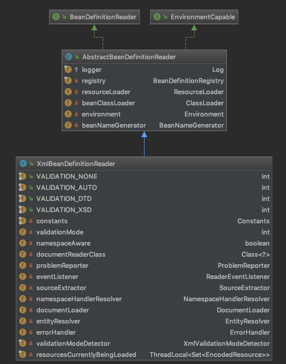

## 1.IOC容器初始化的三个过程

简单来说，Ioc容器的初始化是由前面介绍的refresh()方法来启动的，这个方法标志着Ioc容器的正式启动。具体来说这个启动过程包括**BeanDefinition的Resource定位**、**载入**、**注册**三个基本过程。**Spring把这三个过程分开，并使用不同的模块来完成，如使用相应的ResourceLoader、BeanDefinitionReader等模块**，通过这样的方式，可以让用户更加灵活地对这三个过程进行剪裁或扩展，定义出最合适自己的Ioc容器的初始化过程。

* Resource定位过程(找beans.xml)
  * 这个Resource定位指的是BeanDefinition的资源定位，它由ResourceLoader通过统一的Resource接口来完成，这个Resource对各种形式的BeanDefinition的使用都提供了统一接口。例如`FileSystemResource`、`ClassPathResource`，主要取决于spring bean配置文件放在哪里。
* BeanDefinition的载入(beans.xml -> BeanDefinition)
  * 这个载入过程是把用户定义好的Bean表示称Ioc容器内部的数据结构`BeanDefinition`。
  * `BeanDefinition`实际上就是POJO对象在Ioc容器中的抽象，通过这个BeanDefinition，是Ioc容器能够方便的对POJO对象也就是Bean进行管理。
* 将BeanDefinition注册到Ioc容器
  * 这个过程是通过调用BeanDefinitionRegistry接口的实现来完成的。这个过程将载入过程中解析到的BeanDefinition注册到Ioc容器中(一个HashMap)中。

> 注意：通常情况下Spring Ioc容器初始化的过程，一般不包含Bean依赖注入的实现。Bean的定义的载入和依赖注入是两个独立的过程。依赖注入一般发生在应用第一次通过getBean向容器索取Bean的时候


这里必须要有一张轮廓图，来展示一下类的继承关系


让我们来简单的描述一下这个继承关系吧，只捡重要的说吧

* （I）**ApplicationContext**
  * （I）**ConfigurableApplicationContext**
    * AbstractApplicationContext
      * AbstractRefreshableApplicationContext
        * AbstractRefreshableConfigApplicationContext
          * AbstractXmlApplicationContext
            * FileSystemXmlApplicationContext


## 2.IOC容器初始化 定位、解析、注册

以我们经常使用的ApplicationContext为例，例如

* FileSystemXmlApplicationContext
  * 可以从文件系统载入Resource
* ClassPathXmlApplicationContext
  * 可以从Class Path载入Resource
* XmlWebApplicationContext。
  * 可以在Web容器中载入Resource

我们以`FileSystemXmlApplicationContext`为例，分析这个Resource定位过程。


#### 2.1 DefaultResourceLoader

我们先来看一下ResourceLoader接口，规定了一个通过location获取Resource实现的getResource()方法

```java
public interface ResourceLoader{
  String CLASSPATH_URL_PREFIX = "classpath:";
  Resource getResource(String location);
  ClassLoader getClassLoader();
}
```

再来看一下ResourceLoader的默认实现

```java
public class DefaultResourceLoader implements ResourceLoader {
  private ClassLoader classLoader;
  private final Set<ProtocolResolver> protocolResolvers = new LinkedHashset<>(4);
  private final Map<Class<?>,Map<Resource,?>> resourceCaches = new ConcurrentHashMap<>(4);
  
  public DefaultResourceLoader(){
    this.classLoader = ClassUtils.getDefaultClassLoader();
  }
  
  public DefaultResourceLoader(ClassLoader classLoader){
    this.classLoader = classLoader;
  }
  
  public void addProtocolResolver(ProtocolResolver resolver) {
		Assert.notNull(resolver, "ProtocolResolver must not be null");
		this.protocolResolvers.add(resolver);
	}
  
  public <T> Map<Resource, T> getResourceCache(Class<T> valueType) {
		return (Map<Resource, T>) this.resourceCaches.computeIfAbsent(valueType, key -> new ConcurrentHashMap<>());
	}
  
  @Override
  public ClassLoader getClassLoader(){
    return (this.classLoader!=null?this.classLoader:ClassUtils.getDefaultClassLoader());
  }
  
  /**
  *	获取Resource的具体实现方法：根据不同的location获取不同的Resource实现
  *		ClassPathResource
  *		FileUrlResource
  *		UrlResource
  */
  @Override
	public Resource getResource(String location) {
		Assert.notNull(location, "Location must not be null");

		for (ProtocolResolver protocolResolver : this.protocolResolvers) {
			Resource resource = protocolResolver.resolve(location, this);
			if (resource != null) {
				return resource;
			}
		}
		//如果是类路径的方式，那需要使用ClassPathResource 来得到bean 文件的资源对象
		if (location.startsWith("/")) {
			return getResourceByPath(location);
		}
		else if (location.startsWith(CLASSPATH_URL_PREFIX)) {
			return new ClassPathResource(location.substring(CLASSPATH_URL_PREFIX.length()), getClassLoader());
		}
		else {
			try {
				// Try to parse the location as a URL...
				// 如果是URL 方式，使用UrlResource 作为bean 文件的资源对象
				URL url = new URL(location);
				return (ResourceUtils.isFileURL(url) ? new FileUrlResource(url) : new UrlResource(url));
			}
			catch (MalformedURLException ex) {
				// No URL -> resolve as resource path.
				//如果既不是classpath标识，又不是URL标识的Resource定位，则调用
				//容器本身的getResourceByPath方法获取Resource
				return getResourceByPath(location);
			}
		}
	}
  
  /**
  * FileSystemXmlApplicationContext重写了这个方法，返回了FileSystemResource对象
  */
  protected Resource getResourceByPath(String path) {
		return new ClassPathContextResource(path, getClassLoader());
	}
  
}
```

我们再来看一下FileSystemXmlApplicationContext关于Resource的这部分代码实现

```java
public class FileSystemXmlApplicationContext extends AbstractXmlApplicationContext{
  @Override
	protected Resource getResourceByPath(String path) {
		if (path.startsWith("/")) {
			path = path.substring(1);
		}
		//这里使用文件系统资源对象来定义bean 文件
		return new FileSystemResource(path);
	}
}
```

FileSystemXmlApplicationContext通过继承AbstractApplicationContext具备了ResourceLoader读入以Resource定义的BeanDefinition的能力(因为AbstractApplicationContext的基类是DefaultResourceLoader);

```java
public class FileSystemXmlApplicationContext extends AbstractXmlApplicationContext{
  public FileSystemXmlApplicationContext() {}
  
  public FileSystemXmlApplicationContext(ApplicationContext parent) {
		super(parent);
	}
  
  public FileSystemXmlApplicationContext(String configLocation) throws BeansException {
		this(new String[] {configLocation}, true, null);
	}
  
  public FileSystemXmlApplicationContext(String... configLocations) throws BeansException{
		this(configLocations, true, null);
	}
  
  public FileSystemXmlApplicationContext(String[] configLocations, ApplicationContext parent) throws BeansException {
		this(configLocations, true, parent);
	}
  
  public FileSystemXmlApplicationContext(String[] configLocations, boolean refresh) throws BeansException {
		this(configLocations, refresh, null);
	}
  
  /**
  * 这个构造函数是最重要的
  *		String[] configLocations xml格式定制的BeanDefinition文件位置
  *		boolean refresh 是否刷新容器，重新加载容器内的Bean
  * 	ApplicaitonContext parent 定义父容器
  */
  public FileSystemXmlApplicationContext(
			String[] configLocations, boolean refresh, @Nullable ApplicationContext parent)
			throws BeansException {

		super(parent);
		setConfigLocations(configLocations);
		if (refresh) {
			refresh();
		}
	}
  
  @Override
	protected Resource getResourceByPath(String path) {
		if (path.startsWith("/")) {
			path = path.substring(1);
		}
		//这里使用文件系统资源对象来定义bean 文件
		return new FileSystemResource(path);
	}
}
```

> FileSystemApplicationContext是一个支持XML定义BeanDefinition的ApplicationContext，并且可以指定以文件形式的BeanDefinition的读入，这些文件可以使用文件路径和URL定义来表示。


### 2.2 Resource资源定位时序图


### 2.3 定位

> 发起点 FileSystemXmlApplicationcontext构造函数，refresh();

```java
public FileSystemXmlApplicationContext(
			String[] configLocations, boolean refresh, @Nullable ApplicationContext parent)
			throws BeansException {

		super(parent);
		setConfigLocations(configLocations);
		if (refresh) {
			refresh();
		}
	}
```

在`FileSystemXmlApplicationContext`构造函数中调用了`AbstractApplicationContext`的refresh()，方法，这个方法是个模版方法，整个容器初始化的流程都在这个方法中。

> 传说中的refresh()方法

```java
@Override
public void refresh() throws BeansException, IllegalStateException {
	synchronized (this.startupShutdownMonitor) {
		// Prepare this context for refreshing.
		//1、调用容器准备刷新的方法，获取容器的当时时间，同时给容器设置同步标识
		prepareRefresh();

		// Tell the subclass to refresh the internal bean factory.
		/** 2、告诉子类启动refreshBeanFactory()方法，Bean定义资源文件的载入从
		       子类的refreshBeanFactory()方法启动 BeanDefinition对象生成  */
		ConfigurableListableBeanFactory beanFactory = obtainFreshBeanFactory();
		......
}
```

这里只列出了部分代码，简单的两行代码包含了IOC容器的三个阶段定位、加载、注册，方法`prepareRefresh()`方法设置了一些刷新用到的参数；我们来详细看看`obtainFreshBeanFactory()`这个方法都做了什么

> obtainFreshBeanFactory方法干了点啥呢？

```java
protected ConfigurableListableBeanFactory obtainFreshBeanFactory() {
	//这里使用了委派设计模式，父类定义了抽象的refreshBeanFactory()方法，具体实现调用子类容器的refreshBeanFactory()方法
	refreshBeanFactory();
	ConfigurableListableBeanFactory beanFactory = getBeanFactory();
	if (logger.isDebugEnabled()) {
		logger.debug("Bean factory for " + getDisplayName() + ": " + beanFactory);
	}
	return beanFactory;
}
```

再来看看`AbstractRefreshableApplicationContext`的`refreshBeanFactory`方法

* 如果存在BeanFactory，则先销毁
* 重新创建一个`DefaultListableBeanFactory`
* beanFactory自定义设置
* `loadBeanDefinitions(beanFactory)`重新加载bean

```java
@Override
protected final void refreshBeanFactory() throws BeansException {
	//如果已经有容器，销毁容器中的bean，关闭容器
	if (hasBeanFactory()) {
		destroyBeans();
		closeBeanFactory();
	}
	try {
		//创建IOC容器
		DefaultListableBeanFactory beanFactory = createBeanFactory();
		beanFactory.setSerializationId(getId());
		//对IOC容器进行定制化，如设置启动参数，开启注解的自动装配等
		customizeBeanFactory(beanFactory);
		//调用载入Bean定义的方法，主要这里又使用了一个委派模式，在当前类中只定义了抽象的loadBeanDefinitions方法，具体的实现调用子类容器
		loadBeanDefinitions(beanFactory);
		synchronized (this.beanFactoryMonitor) {
			this.beanFactory = beanFactory;
		}
	}
	catch (IOException ex) {
		throw new ApplicationContextException("I/O error parsing bean definition source for " + getDisplayName(), ex);
	}
}
```

> `AbstractXmlApplicationcontext`的loadBeanDefinitions方法

```java
@Override
protected void loadBeanDefinitions(DefaultListableBeanFactory beanFactory) throws BeansException, IOException {
	// Create a new XmlBeanDefinitionReader for the given BeanFactory.
	//创建XmlBeanDefinitionReader，即创建Bean读取器，并通过回调设置到容器中去，容  器使用该读取器读取Bean定义资源
	XmlBeanDefinitionReader beanDefinitionReader = new XmlBeanDefinitionReader(beanFactory);

	// Configure the bean definition reader with this context's
	// resource loading environment.
	//为Bean读取器设置Spring资源加载器，AbstractXmlApplicationContext的
	//祖先父类AbstractApplicationContext继承DefaultResourceLoader，因此，容器本身也是一个资源加载器
	beanDefinitionReader.setEnvironment(this.getEnvironment());
	beanDefinitionReader.setResourceLoader(this);
	//为Bean读取器设置SAX xml解析器
	beanDefinitionReader.setEntityResolver(new ResourceEntityResolver(this));

	// Allow a subclass to provide custom initialization of the reader,
	// then proceed with actually loading the bean definitions.
	//当Bean读取器读取Bean定义的Xml资源文件时，启用Xml的校验机制
	initBeanDefinitionReader(beanDefinitionReader);
	//Bean读取器真正实现加载的方法
	loadBeanDefinitions(beanDefinitionReader);
}
```

在这块儿代码逻辑中，我们发现了`XmlBeanDefinitionReader` 这个对象。没错，xml文件中bean变成BeanDefinition就是委托给这个对象来实现的。

> XmlBeanDefinitionReader

 我们先来认识一下`XmlBeanDefinitionReader`



在`AbstractXmlApplicationcontext`的loadBeanDefinitions方法中，new了一个`XmlBeanDefinitionReader`，代码如下所示

```java
//将DefaultListableBeanFactory作为参数，传递给了XmlBeanDefinitionReader的构造函数
XmlBeanDefinitionReader beanDefinitionReader = new XmlBeanDefinitionReader(beanFactory);
```

之所以把`DefaultListableBeanFactory`当作参数传递给`XmlBeanDefinitionReader`的构造函数，是因为`DefaultListableBeanFactory`实现了`BeanDefinitionRegistry`这个接口

那我们先来看一看`XmlBeanDefinitionReader`的构造函数吧

```java
private final BeanDefinitionRegistry registry;
private ResourceLoader resourceLoader;

public XmlBeanDefinitionReader(BeanDefinitionRegistry registry) {
  super(registry);
}

protected AbstractBeanDefinitionReader(BeanDefinitionRegistry registry) {
  Assert.notNull(registry, "BeanDefinitionRegistry must not be null");
  this.registry = registry;

  if (this.registry instanceof ResourceLoader) {
    this.resourceLoader = (ResourceLoader) this.registry;
  }
  else {
    this.resourceLoader = new PathMatchingResourcePatternResolver();
  }

  // Inherit Environment if possible
  if (this.registry instanceof EnvironmentCapable) {
    this.environment = ((EnvironmentCapable) this.registry).getEnvironment();
  }
  else {
    this.environment = new StandardEnvironment();
  }
}
```

> 接着看`XmlBeanDefinitionReader`的loadBeanDefinitions(String... locations)吧

```java
@Override
public int loadBeanDefinitions(String... locations) throws BeanDefinitionStoreException {
  Assert.notNull(locations, "Location array must not be null");
  int counter = 0;
  for (String location : locations) {
    counter += loadBeanDefinitions(location);
  }
  return counter;
}

@Override
public int loadBeanDefinitions(String location) throws BeanDefinitionStoreException {
  return loadBeanDefinitions(location, null);
}

public int loadBeanDefinitions(String location, @Nullable Set<Resource> actualResources) throws BeanDefinitionStoreException {
  //获取在IoC容器初始化过程中设置的资源加载器
  ResourceLoader resourceLoader = getResourceLoader();
  if (resourceLoader == null) {
    throw new BeanDefinitionStoreException(
      "Cannot import bean definitions from location [" + location + "]: no ResourceLoader available");
  }

  if (resourceLoader instanceof ResourcePatternResolver) {
    // Resource pattern matching available.
    try {
      //将指定位置的Bean定义资源文件解析为Spring IOC容器封装的资源
      //加载多个指定位置的Bean定义资源文件
      Resource[] resources = ((ResourcePatternResolver) resourceLoader).getResources(location);
      //委派调用其子类XmlBeanDefinitionReader的方法，实现加载功能
      int loadCount = loadBeanDefinitions(resources);
      if (actualResources != null) {
        for (Resource resource : resources) {
          actualResources.add(resource);
        }
      }
      if (logger.isDebugEnabled()) {
        logger.debug("Loaded " + loadCount + " bean definitions from location pattern [" + location + "]");
      }
      return loadCount;
    }
    catch (IOException ex) {
      throw new BeanDefinitionStoreException(
        "Could not resolve bean definition resource pattern [" + location + "]", ex);
    }
  }
  else {
    // Can only load single resources by absolute URL.
    //将指定位置的Bean定义资源文件解析为Spring IOC容器封装的资源
    //加载单个指定位置的Bean定义资源文件
    Resource resource = resourceLoader.getResource(location);
    //委派调用其子类XmlBeanDefinitionReader的方法，实现加载功能
    int loadCount = loadBeanDefinitions(resource);
    if (actualResources != null) {
      actualResources.add(resource);
    }
    if (logger.isDebugEnabled()) {
      logger.debug("Loaded " + loadCount + " bean definitions from location [" + location + "]");
    }
    return loadCount;
  }
}
```

### 2.4 解析

> `XmlBeanDefinitionReader`的`loadBeanDefinitions(Resource resouce)`

```java
@Override
public int loadBeanDefinitions(Resource resource) throws BeanDefinitionStoreException {
  //将读入的XML资源进行特殊编码处理
  return loadBeanDefinitions(new EncodedResource(resource));
}

//这里是载入XML形式Bean定义资源文件方法
public int loadBeanDefinitions(EncodedResource encodedResource) throws BeanDefinitionStoreException {
  Assert.notNull(encodedResource, "EncodedResource must not be null");
  if (logger.isInfoEnabled()) {
    logger.info("Loading XML bean definitions from " + encodedResource.getResource());
  }

  Set<EncodedResource> currentResources = this.resourcesCurrentlyBeingLoaded.get();
  if (currentResources == null) {
    currentResources = new HashSet<>(4);
    this.resourcesCurrentlyBeingLoaded.set(currentResources);
  }
  if (!currentResources.add(encodedResource)) {
    throw new BeanDefinitionStoreException(
      "Detected cyclic loading of " + encodedResource + " - check your import definitions!");
  }
  try {
    //将资源文件转为InputStream的IO流
    InputStream inputStream = encodedResource.getResource().getInputStream();
    try {
      //从InputStream中得到XML的解析源
      InputSource inputSource = new InputSource(inputStream);
      if (encodedResource.getEncoding() != null) {
        inputSource.setEncoding(encodedResource.getEncoding());
      }
      //这里是具体的读取过程
      return doLoadBeanDefinitions(inputSource, encodedResource.getResource());
    }
    finally {
      //关闭从Resource中得到的IO流
      inputStream.close();
    }
  }
  catch (IOException ex) {
    throw new BeanDefinitionStoreException(
      "IOException parsing XML document from " + encodedResource.getResource(), ex);
  }
  finally {
    currentResources.remove(encodedResource);
    if (currentResources.isEmpty()) {
      this.resourcesCurrentlyBeingLoaded.remove();
    }
  }
}
```

> `XmlBeanDefinitionReader`的`doLoadBeanDefinitions`方法

```java
//从特定XML文件中实际载入Bean定义资源的方法
protected int doLoadBeanDefinitions(InputSource inputSource, Resource resource)
  throws BeanDefinitionStoreException {
  //将XML文件转换为DOM对象，解析过程由documentLoader实现
  Document doc = doLoadDocument(inputSource, resource);
  //这里是启动对Bean定义解析的详细过程，该解析过程会用到Spring的Bean配置规则
  return registerBeanDefinitions(doc, resource);
}
```

> `XmlBeanDefinitionReader`的`registerBeanDefinitions`方法

```java
//按照Spring的Bean语义要求将Bean定义资源解析并转换为容器内部数据结构
public int registerBeanDefinitions(Document doc, Resource resource) throws BeanDefinitionStoreException {
  //得到BeanDefinitionDocumentReader来对xml格式的BeanDefinition解析
  BeanDefinitionDocumentReader documentReader = createBeanDefinitionDocumentReader();
  //获得容器中注册的Bean数量
  int countBefore = getRegistry().getBeanDefinitionCount();
  //解析过程入口，这里使用了委派模式，BeanDefinitionDocumentReader只是个接口,
  //具体的解析实现过程有实现类DefaultBeanDefinitionDocumentReader完成
  documentReader.registerBeanDefinitions(doc, createReaderContext(resource));
  //统计解析的Bean数量
  return getRegistry().getBeanDefinitionCount() - countBefore;
}
```

> 我勒个乖乖，咋又出现个BeanDefinitionDocumentReader

```java
public interface BeanDefinitionDocumentReader {
  void registerBeanDefinitions(Document doc, XmlReaderContext readerContext)
    throws BeanDefinitionStoreException;

}
```

原来是个接口呀，是一个只有一个方法的接口呀，吓我一跳，看看实现类吧

```java
public class DefaultBeanDefinitionDocumentReader implements BeanDefinitionDocumentReader {
  private XmlReaderContext readerContext;
  private BeanDefinitionParserDelegate delegate;
}

//根据Spring DTD对Bean的定义规则解析Bean定义Document对象
@Override
public void registerBeanDefinitions(Document doc, XmlReaderContext readerContext) {
  //获得XML描述符
  this.readerContext = readerContext;
  logger.debug("Loading bean definitions");
  //获得Document的根元素
  Element root = doc.getDocumentElement();
  doRegisterBeanDefinitions(root);
}

```

> `DefaultBeanDefinitionDocumentReader`的`doRegisterBeanDefinitions`方法

```java
protected void doRegisterBeanDefinitions(Element root) {
  //具体的解析过程由BeanDefinitionParserDelegate实现，
  //BeanDefinitionParserDelegate中定义了Spring Bean定义XML文件的各种元素
  BeanDefinitionParserDelegate parent = this.delegate;
  this.delegate = createDelegate(getReaderContext(), root, parent);

  if (this.delegate.isDefaultNamespace(root)) {
    String profileSpec = root.getAttribute(PROFILE_ATTRIBUTE);
    if (StringUtils.hasText(profileSpec)) {
      String[] specifiedProfiles = StringUtils.tokenizeToStringArray(
        profileSpec, BeanDefinitionParserDelegate.MULTI_VALUE_ATTRIBUTE_DELIMITERS);
      if (!getReaderContext().getEnvironment().acceptsProfiles(specifiedProfiles)) {
        if (logger.isInfoEnabled()) {
          logger.info("Skipped XML bean definition file due to specified profiles [" + profileSpec +
                      "] not matching: " + getReaderContext().getResource());
        }
        return;
      }
    }
  }
  //在解析Bean定义之前，进行自定义的解析，增强解析过程的可扩展性
  preProcessXml(root);
  //从Document的根元素开始进行Bean定义的Document对象
  parseBeanDefinitions(root, this.delegate);
  //在解析Bean定义之后，进行自定义的解析，增加解析过程的可扩展性
  postProcessXml(root);

  this.delegate = parent;
}
```

> `DefaultBeanDefinitionDocumentReader`的`parseBeanDefinitions`方法

```java
//使用Spring的Bean规则从Document的根元素开始进行Bean定义的Document对象
protected void parseBeanDefinitions(Element root, BeanDefinitionParserDelegate delegate) {
  //Bean定义的Document对象使用了Spring默认的XML命名空间
  if (delegate.isDefaultNamespace(root)) {
    //获取Bean定义的Document对象根元素的所有子节点
    NodeList nl = root.getChildNodes();
    for (int i = 0; i < nl.getLength(); i++) {
      Node node = nl.item(i);
      //获得Document节点是XML元素节点
      if (node instanceof Element) {
        Element ele = (Element) node;
        //Bean定义的Document的元素节点使用的是Spring默认的XML命名空间
        if (delegate.isDefaultNamespace(ele)) {
          //使用Spring的Bean规则解析元素节点
          parseDefaultElement(ele, delegate);
        }
        else {
          //没有使用Spring默认的XML命名空间，则使用用户自定义的解//析规则解析元素节点
          delegate.parseCustomElement(ele);
        }
      }
    }
  }
  else {
    //Document的根节点没有使用Spring默认的命名空间，则使用用户自定义的
    //解析规则解析Document根节点
    delegate.parseCustomElement(root);
  }
}
```

> `DefaultBeanDefinitionDocumentReader`的`parseDefaultElement`方法

```java
//使用Spring的Bean规则解析Document元素节点
private void parseDefaultElement(Element ele, BeanDefinitionParserDelegate delegate) {
  //如果元素节点是<Import>导入元素，进行导入解析
  if (delegate.nodeNameEquals(ele, IMPORT_ELEMENT)) {
    importBeanDefinitionResource(ele);
  }
  //如果元素节点是<Alias>别名元素，进行别名解析
  else if (delegate.nodeNameEquals(ele, ALIAS_ELEMENT)) {
    processAliasRegistration(ele);
  }
  //元素节点既不是导入元素，也不是别名元素，即普通的<Bean>元素，
  //按照Spring的Bean规则解析元素
  else if (delegate.nodeNameEquals(ele, BEAN_ELEMENT)) {
    processBeanDefinition(ele, delegate);
  }
  else if (delegate.nodeNameEquals(ele, NESTED_BEANS_ELEMENT)) {
    // recurse
    doRegisterBeanDefinitions(ele);
  }
}
```

### 3.2.5 注册

> `DefaultBeanDefinitionDocumentReader`的`processBeanDefinition`方法

```java
//解析Bean定义资源Document对象的普通元素
protected void processBeanDefinition(Element ele, BeanDefinitionParserDelegate delegate) {
  BeanDefinitionHolder bdHolder = delegate.parseBeanDefinitionElement(ele);
  // BeanDefinitionHolder是对BeanDefinition的封装，即Bean定义的封装类
  //对Document对象中<Bean>元素的解析由BeanDefinitionParserDelegate实现
  // BeanDefinitionHolder bdHolder = delegate.parseBeanDefinitionElement(ele);
  if (bdHolder != null) {
    bdHolder = delegate.decorateBeanDefinitionIfRequired(ele, bdHolder);
    try {
      // Register the final decorated instance.
      //向Spring IOC容器注册解析得到的Bean定义，这是Bean定义向IOC容器注册的入口
      BeanDefinitionReaderUtils.registerBeanDefinition(bdHolder, getReaderContext().getRegistry());
    }
    catch (BeanDefinitionStoreException ex) {
      getReaderContext().error("Failed to register bean definition with name '" +
                               bdHolder.getBeanName() + "'", ele, ex);
    }
    // Send registration event.
    //在完成向Spring IOC容器注册解析得到的Bean定义之后，发送注册事件
    getReaderContext().fireComponentRegistered(new BeanComponentDefinition(bdHolder));
  }
}
```

> `BeanDefinitionReaderUtils`的`registerBeanDefinition`方法

```java
//将解析的BeanDefinitionHold注册到容器中
public static void registerBeanDefinition(
  BeanDefinitionHolder definitionHolder, BeanDefinitionRegistry registry)
  throws BeanDefinitionStoreException {
  
  // Register bean definition under primary name.
  //获取解析的BeanDefinition的名称
  String beanName = definitionHolder.getBeanName();
  //向IOC容器注册BeanDefinition
  registry.registerBeanDefinition(beanName, definitionHolder.getBeanDefinition());

  // Register aliases for bean name, if any.
  //如果解析的BeanDefinition有别名，向容器为其注册别名
  String[] aliases = definitionHolder.getAliases();
  if (aliases != null) {
    for (String alias : aliases) {
      registry.registerAlias(beanName, alias);
    }
  }
}
```

终于结束了，到这里IOC容器已经初始化完成了，最后还是调用**registry.registerBeanDefinition(beanName,definitionHolder.getBeanDefinition())**，将beanDefinition注册到前面创建的DefaultListableBeanFactory中去的;

> `DefaultListableBeanFactory`的registerBeanDefinition方法

```java
//向IOC容器注册解析的BeanDefiniton
@Override
public void registerBeanDefinition(String beanName, BeanDefinition beanDefinition)
  throws BeanDefinitionStoreException {

  Assert.hasText(beanName, "Bean name must not be empty");
  Assert.notNull(beanDefinition, "BeanDefinition must not be null");

  //校验解析的BeanDefiniton
  if (beanDefinition instanceof AbstractBeanDefinition) {
    try {
      ((AbstractBeanDefinition) beanDefinition).validate();
    }
    catch (BeanDefinitionValidationException ex) {
      throw new BeanDefinitionStoreException(beanDefinition.getResourceDescription(), beanName,
                                             "Validation of bean definition failed", ex);
    }
  }

  BeanDefinition oldBeanDefinition;

  oldBeanDefinition = this.beanDefinitionMap.get(beanName);

  if (oldBeanDefinition != null) {
    if (!isAllowBeanDefinitionOverriding()) {
      throw new BeanDefinitionStoreException(beanDefinition.getResourceDescription(), beanName,
                                             "Cannot register bean definition [" + beanDefinition + "] for bean '" + beanName +
                                             "': There is already [" + oldBeanDefinition + "] bound.");
    }
    else if (oldBeanDefinition.getRole() < beanDefinition.getRole()) {
      // e.g. was ROLE_APPLICATION, now overriding with ROLE_SUPPORT or ROLE_INFRASTRUCTURE
      if (this.logger.isWarnEnabled()) {
        this.logger.warn("Overriding user-defined bean definition for bean '" + beanName +
                         "' with a framework-generated bean definition: replacing [" +
                         oldBeanDefinition + "] with [" + beanDefinition + "]");
      }
    }
    else if (!beanDefinition.equals(oldBeanDefinition)) {
      if (this.logger.isInfoEnabled()) {
        this.logger.info("Overriding bean definition for bean '" + beanName +
                         "' with a different definition: replacing [" + oldBeanDefinition +
                         "] with [" + beanDefinition + "]");
      }
    }
    else {
      if (this.logger.isDebugEnabled()) {
        this.logger.debug("Overriding bean definition for bean '" + beanName +
                          "' with an equivalent definition: replacing [" + oldBeanDefinition +
                          "] with [" + beanDefinition + "]");
      }
    }
    this.beanDefinitionMap.put(beanName, beanDefinition);
  }
  else {
    if (hasBeanCreationStarted()) {
      // Cannot modify startup-time collection elements anymore (for stable iteration)
      //注册的过程中需要线程同步，以保证数据的一致性
      synchronized (this.beanDefinitionMap) {
        this.beanDefinitionMap.put(beanName, beanDefinition);
        List<String> updatedDefinitions = new ArrayList<>(this.beanDefinitionNames.size() + 1);
        updatedDefinitions.addAll(this.beanDefinitionNames);
        updatedDefinitions.add(beanName);
        this.beanDefinitionNames = updatedDefinitions;
        if (this.manualSingletonNames.contains(beanName)) {
          Set<String> updatedSingletons = new LinkedHashSet<>(this.manualSingletonNames);
          updatedSingletons.remove(beanName);
          this.manualSingletonNames = updatedSingletons;
        }
      }
    }
    else {
      // Still in startup registration phase
      this.beanDefinitionMap.put(beanName, beanDefinition);
      this.beanDefinitionNames.add(beanName);
      this.manualSingletonNames.remove(beanName);
    }
    this.frozenBeanDefinitionNames = null;
  }

  //检查是否有同名的BeanDefinition已经在IOC容器中注册
  if (oldBeanDefinition != null || containsSingleton(beanName)) {
    //重置所有已经注册过的BeanDefinition的缓存
    resetBeanDefinition(beanName);
  }
}
```


## 3.几个问题

#### 1.Bean何时初始化？有什么配置

注意：通常情况下Spring Ioc容器初始化的过程，一般不包含Bean依赖注入的实现。Bean的定义的载入和依赖注入是两个独立的过程。依赖注入一般发生在应用第一次通过getBean向容器索取Bean的时候。但有一个例外，在使用IOC容器时有一个预先实例化的配置（Bean的lazyinit属性，但是有个前提，**scope属性为singleton**）。

```xml
<bean id="testBean" class="com.g6.test.TestBean"/>
<!-- lazy-init=true 延迟加载，在容器第一次调用getBean()时实例化 -->
<!-- lazy-init=false 立即加载，在Spring启动时，立刻进行实例化 -->
<bean id="test1Bean" class="com.g6.test.Test1Bean" lazy-init="false"/>
```

```java
@Lazy(true)
```

#### 2.Spring Bean scope

* singleton
  * 在每一个Spring容器中，一个Bean定义只有一个对象实例(默认)
* prototype
  * 允许Bean的定义被实例化任意次(每次调用都创建一个实例)
* request
  * 在一次Http请求中，每个Bean定义对应一个实例。(Spring MVC有效)
* session
  * 在一个HTTP Session中，每个Bean定义对应一个实例（Spring MVC有效）
* Global-session
  * 在一个全局Http Session中，每个Bean定义对应一个实例。该作用域仅在Portlet上下文中才有效。


