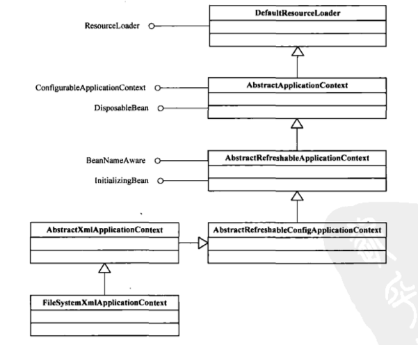

### 1.IOC容器初始化的三个过程

简单来说，Ioc容器的初始化是由前面介绍的refresh()方法来启动的，这个方法标志着Ioc容器的正式启动。具体来说这个启动过程包括**BeanDefinition的Resource定位**、**载入**、**注册**三个基本过程。**Spring把这三个过程分开，并使用不同的模块来完成，如使用相应的ResourceLoader、BeanDefinitionReader等模块**，通过这样的方式，可以让用户更加灵活地对这三个过程进行剪裁或扩展，定义出最合适自己的Ioc容器的初始化过程。

* Resource定位过程(找beans.xml)
  * 这个Resource定位指的是BeanDefinition的资源定位，它由ResourceLoader通过统一的Resource接口来完成，这个Resource对各种形式的BeanDefinition的使用都提供了统一接口。例如`FileSystemResource`、`ClassPathResource`，主要取决于spring bean配置文件放在哪里。
* BeanDefinition的载入(beans.xml -> BeanDefinition)
  * 这个载入过程是把用户定义好的Bean表示称Ioc容器内部的数据结构`BeanDefinition`。
  * `BeanDefinition`实际上就是POJO对象在Ioc容器中的抽象，通过这个BeanDefinition，是Ioc容器能够方便的对POJO对象也就是Bean进行管理。
* 将BeanDefinition注册到Ioc容器
  * 这个过程是通过调用BeanDefinitionRegistry接口的实现来完成的。这个过程将载入过程中解析到的BeanDefinition注册到Ioc容器中(一个HashMap)中。

> 注意：通常情况下Spring Ioc容器初始化的过程，一般不包含Bean依赖注入的实现。Bean的定义的载入和依赖注入是两个独立的过程。依赖注入一般发生在应用第一次通过getBean向容器索取Bean的时候


这里必须要有一张轮廓图，来展示一下类的继承关系


让我们来简单的描述一下这个继承关系吧，只捡重要的说吧

* （I）**ApplicationContext**
  * （I）**ConfigurableApplicationContext**
    * AbstractApplicationContext
      * AbstractRefreshableApplicationContext
        * AbstractRefreshableConfigApplicationContext
          * AbstractXmlApplicationContext
            * FileSystemXmlApplicationContext


### 2.BeanDefinition的Resource定位

以我们经常使用的ApplicationContext为例，例如

* FileSystemXmlApplicationContext
  * 可以从文件系统载入Resource
* ClassPathXmlApplicationContext
  * 可以从Class Path载入Resource
* XmlWebApplicationContext。
  * 可以在Web容器中载入Resource

我们以`FileSystemXmlApplicationContext`为例，分析这个Resource定位过程。



#### 2.1 DefaultResourceLoader

我们先来看一下ResourceLoader接口，规定了一个通过location获取Resource实现的getResource()方法

```java
public interface ResourceLoader{
  String CLASSPATH_URL_PREFIX = "classpath:";
  Resource getResource(String location);
  ClassLoader getClassLoader();
}
```

再来看一下ResourceLoader的默认实现

```java
public class DefaultResourceLoader implements ResourceLoader {
  private ClassLoader classLoader;
  private final Set<ProtocolResolver> protocolResolvers = new LinkedHashset<>(4);
  private final Map<Class<?>,Map<Resource,?>> resourceCaches = new ConcurrentHashMap<>(4);
  
  public DefaultResourceLoader(){
    this.classLoader = ClassUtils.getDefaultClassLoader();
  }
  
  public DefaultResourceLoader(ClassLoader classLoader){
    this.classLoader = classLoader;
  }
  
  public void addProtocolResolver(ProtocolResolver resolver) {
		Assert.notNull(resolver, "ProtocolResolver must not be null");
		this.protocolResolvers.add(resolver);
	}
  
  public <T> Map<Resource, T> getResourceCache(Class<T> valueType) {
		return (Map<Resource, T>) this.resourceCaches.computeIfAbsent(valueType, key -> new ConcurrentHashMap<>());
	}
  
  @Override
  public ClassLoader getClassLoader(){
    return (this.classLoader!=null?this.classLoader:ClassUtils.getDefaultClassLoader());
  }
  
  /**
  *	获取Resource的具体实现方法：根据不同的location获取不同的Resource实现
  *		ClassPathResource
  *		FileUrlResource
  *		UrlResource
  */
  @Override
	public Resource getResource(String location) {
		Assert.notNull(location, "Location must not be null");

		for (ProtocolResolver protocolResolver : this.protocolResolvers) {
			Resource resource = protocolResolver.resolve(location, this);
			if (resource != null) {
				return resource;
			}
		}
		//如果是类路径的方式，那需要使用ClassPathResource 来得到bean 文件的资源对象
		if (location.startsWith("/")) {
			return getResourceByPath(location);
		}
		else if (location.startsWith(CLASSPATH_URL_PREFIX)) {
			return new ClassPathResource(location.substring(CLASSPATH_URL_PREFIX.length()), getClassLoader());
		}
		else {
			try {
				// Try to parse the location as a URL...
				// 如果是URL 方式，使用UrlResource 作为bean 文件的资源对象
				URL url = new URL(location);
				return (ResourceUtils.isFileURL(url) ? new FileUrlResource(url) : new UrlResource(url));
			}
			catch (MalformedURLException ex) {
				// No URL -> resolve as resource path.
				//如果既不是classpath标识，又不是URL标识的Resource定位，则调用
				//容器本身的getResourceByPath方法获取Resource
				return getResourceByPath(location);
			}
		}
	}
  
  /**
  * FileSystemXmlApplicationContext重写了这个方法，返回了FileSystemResource对象
  */
  protected Resource getResourceByPath(String path) {
		return new ClassPathContextResource(path, getClassLoader());
	}
  
}
```

我们再来看一下FileSystemXmlApplicationContext关于Resource的这部分代码实现

```java
public class FileSystemXmlApplicationContext extends AbstractXmlApplicationContext{
  @Override
	protected Resource getResourceByPath(String path) {
		if (path.startsWith("/")) {
			path = path.substring(1);
		}
		//这里使用文件系统资源对象来定义bean 文件
		return new FileSystemResource(path);
	}
}
```

FileSystemXmlApplicationContext通过继承AbstractApplicationContext具备了ResourceLoader读入以Resource定义的BeanDefinition的能力(因为AbstractApplicationContext的基类是DefaultResourceLoader);

```java
public class FileSystemXmlApplicationContext extends AbstractXmlApplicationContext{
  public FileSystemXmlApplicationContext() {}
  
  public FileSystemXmlApplicationContext(ApplicationContext parent) {
		super(parent);
	}
  
  public FileSystemXmlApplicationContext(String configLocation) throws BeansException {
		this(new String[] {configLocation}, true, null);
	}
  
  public FileSystemXmlApplicationContext(String... configLocations) throws BeansException{
		this(configLocations, true, null);
	}
  
  public FileSystemXmlApplicationContext(String[] configLocations, ApplicationContext parent) throws BeansException {
		this(configLocations, true, parent);
	}
  
  public FileSystemXmlApplicationContext(String[] configLocations, boolean refresh) throws BeansException {
		this(configLocations, refresh, null);
	}
  
  /**
  * 这个构造函数是最重要的
  *		String[] configLocations xml格式定制的BeanDefinition文件位置
  *		boolean refresh 是否刷新容器，重新加载容器内的Bean
  * 	ApplicaitonContext parent 定义父容器
  */
  public FileSystemXmlApplicationContext(
			String[] configLocations, boolean refresh, @Nullable ApplicationContext parent)
			throws BeansException {

		super(parent);
		setConfigLocations(configLocations);
		if (refresh) {
			refresh();
		}
	}
  
  @Override
	protected Resource getResourceByPath(String path) {
		if (path.startsWith("/")) {
			path = path.substring(1);
		}
		//这里使用文件系统资源对象来定义bean 文件
		return new FileSystemResource(path);
	}
}
```

> FileSystemApplicationContext是一个支持XML定义BeanDefinition的ApplicationContext，并且可以指定以文件形式的BeanDefinition的读入，这些文件可以使用文件路径和URL定义来表示。


### 2.2 Resource资源定位时序图


### 几个问题

#### 1.Bean何时初始化？有什么配置

注意：通常情况下Spring Ioc容器初始化的过程，一般不包含Bean依赖注入的实现。Bean的定义的载入和依赖注入是两个独立的过程。依赖注入一般发生在应用第一次通过getBean向容器索取Bean的时候。但有一个例外，在使用IOC容器时有一个预先实例化的配置（Bean的lazyinit属性，但是有个前提，**scope属性为singleton**）。

```xml
<bean id="testBean" class="com.g6.test.TestBean"/>
<!-- lazy-init=true 延迟加载，在容器第一次调用getBean()时实例化 -->
<!-- lazy-init=false 立即加载，在Spring启动时，立刻进行实例化 -->
<bean id="test1Bean" class="com.g6.test.Test1Bean" lazy-init="false"/>
```

```java
@Lazy(true)
```

#### 2.Spring Bean scope

* singleton
  * 在每一个Spring容器中，一个Bean定义只有一个对象实例(默认)
* prototype
  * 允许Bean的定义被实例化任意次(每次调用都创建一个实例)
* request
  * 在一次Http请求中，每个Bean定义对应一个实例。(Spring MVC有效)
* session
  * 在一个HTTP Session中，每个Bean定义对应一个实例（Spring MVC有效）
* Global-session
  * 在一个全局Http Session中，每个Bean定义对应一个实例。该作用域仅在Portlet上下文中才有效。


